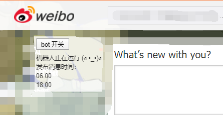

# 疫情播报微博 bot 浏览器插件
+ 数据来源：https://www.tianqiapi.com 接口实时同步卫健委

## 图片示例
+ 控制面板
    + 
+ 发出的消息
    + 

## 如何使用
+ 下载本项目
+ 先登陆微博，切换到发微博的页面
+ chrome 浏览器 菜单 -> 更多工具 -> 扩展程序 -> 加载已解压的扩展程序 -> 选择本项目文件夹
+ 回到微博页面，刷新，插件自动运行
+ 点击按钮右上角的面板按钮，运行程序

## 更新日志
+ 2020.02.04
    + 增加控制面板，默认加载时关闭，需要手动开启
+ 2020.02.08
    + 修复计算 bug
    + 优化控制面板样式，鼠标可以拖动控制面板
    + 样式代码更加人性化
